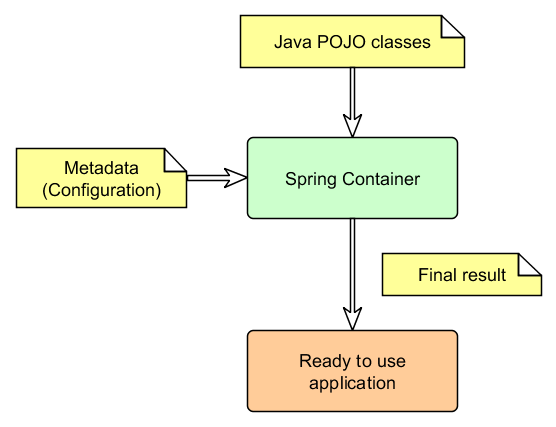

## Spring Core Introduction

Gabor Bata

November, 2016

---

### Introduction to Spring
* Open source application framework
* Modular (MVC, AOP, Integration, Security etc.)
* Extendible
* The most popular framework
* De facto standard

---

### Core Container

The Core Container consists of the following modules:

* **spring-core** and **spring-beans**<br>fundamental part: IoC, DI, BeanFactory
* **spring-context** (ApplicationContext)<br>it is a medium to access any objects defined and configured
* **spring-context-support**<br>provides support for integrating common third-party libraries
* **spring-expression (SpEL)**<br>language to query/manipulate objects at runtime

---

### Inversion of Control (IoC)
* Is an application development concept
* Hollywood Principle: *Don't call us, we'll call you*

> In software engineering, inversion of control (IoC) describes a design in which
> custom-written portions of a computer program receive the flow of control from a generic, reusable library.

---

### Dependency Injection (DI)

Is a form of IoC

> An injection is the passing of a dependency (a service) to a dependent object (a client).
> Passing the service to the client, rather than allowing a client to build or find the service,
> is the fundamental requirement of the pattern.

Two major variants: constructor and setter injection

---

### Benefits of IoC/DI
* Minimizes the amount of code
* Makes the application more testable
* Promotes programming to interfaces
* Loose coupling with minimal effort
* Supports eager instantiation and lazy loading
* Provides control over object lifecycle

---

### Spring IoC container

Create objects, wire them together, configure them, manage their lifecycle from creation to destruction.



---

### Creating application context

**Environments:**

* Standalone
* WEB
* JUnit
* etc.

**Special prefixes:**

* ClassPath
* FileSystem
* RelativePath
* AnnotationConfig

---

### Instantiate standalone context - example

```java
// create and configure beans
ApplicationContext context =
    new ClassPathXmlApplicationContext(new String[] {"services.xml", "daos.xml"});

// retrieve configured instance
UserService service = context.getBean("userService", UserService.class);

// use configured instance
List<String> userList = service.getUsernameList();
```

---

### Context Lifecycle
1. Load definitions
2. BeanFactoryPostProcessor
3. Instantiation
4. Property Injection
5. BeanPostProcessor
6. Ready to use

---

### Bean Lifecycle

1. Instantiate
2. Populate Properties
3. BeanNameAware#setBeanName()
4. BeanFactoryAware#setBeanFactory()
5. ApplicationContextAware#setApplicationContext()
6. Preinitialization BeanPostProcessors
7. InitializingBean#afterPropertiesSet()
8. Call custom init-method
9. Postinitialization BeanPostProcessors
10. Bean is ready to use

---

### Bean Lifecycle - destroy

When container is shut down

1. DisposableBean#destroy()
2. Call custom destroy-method

---

### Bean scopes

* simple: singleton (default), prototype
  ```xml
  <bean id="..." class="..." scope="prototype"> ... </bean>
  ```
* runtime: thread, custom (org.springframework.beans.factory.config.Scope)
* web-aware: request, session, global session, application

---

### XML based Configuration

```xml
<?xml version="1.0" encoding="UTF-8"?>
<beans xmlns="http://www.springframework.org/schema/beans"
    xmlns:xsi="http://www.w3.org/2001/XMLSchema-instance"
    xsi:schemaLocation="http://www.springframework.org/schema/beans
        http://www.springframework.org/schema/beans/spring-beans.xsd">

    <bean id="userService" class="com.acme.UserServiceImpl">
        <property name="userDao" ref="userDao"/>
    </bean>

    <bean id="userDao" class="com.acme.UserDaoImpl">
        <property name="driverClassName" value="${jdbc.driverClassName}" />
        <property name="url" value="${jdbc.url}" />
        <property name="username" value="${jdbc.username}" />
        <property name="password" value="${jdbc.password}" />
    </bean>
</beans>
```

---

### Instantiating bean

A bean can be instantiated with:

1. Constructor
2. Static factory method
3. Instance factory method
4. FactoryBean

---

### Instantiating bean - Constructor

```xml
<bean id="userService" class="com.acme.UserServiceImpl" />
```

```java
public class UserServiceImpl implements UserService {

    public UserServiceImpl() { ... }
}

```

---

### Instantiating bean - Static method

```xml
<bean id="userService" class="com.acme.UserServiceImpl"
    factory-method="createInstance" />
```

```java
public class UserServiceImpl implements UserService {

    private UserServiceImpl() { ... }

    public static UserService createInstance() { ... }
}

```

---

### Instantiating bean - Factory method

```xml
<bean id="userServiceFactory" class="com.acme.UserServiceFactoryImpl"/>
<bean id="userService" factory-bean="userServiceFactory"
    factory-method="createInstance" />

```

```java
public class UserServiceFactory {

    public static UserService createInstance() { ... }
}

```

---

### Instantiating bean - Factory bean

```java
// org.springframework.beans.factory.FactoryBean
public interface FactoryBean<T> {
    T getObject() throws Exception;
    Class<?> getObjectType();
    boolean isSingleton();
}
```

```java
public class UserServiceFactoryBean implements FactoryBean<UserService>{
    public UserService getObject() {
        // create user service
    }

    public Class<Car> getObjectType() { return UserService.class; }

    public boolean isSingleton() { return false; }
}
```

```xml
<bean id="userService" class="com.acme.UserServiceFactoryBean"/>
```

---

### Dependency Injection variants

Major variants:

* Constructor-based
* Setter-based

---

### Constructor-based DI

Good practice to use constructor based DI for mandatory dependencies.
Supports immutability.

```xml
<bean id="userService" class="com.acme.UserServiceImpl">
    <constuctor-arg ref="userDao"/>
</bean>
```

```java
public class UserServiceImpl implements UserService {
    private final UserDao userDao;

    public UserService(UserDao userDao) {
        this.userDao = userDao;
    }
}

```

---

### Setter-based DI

For optional dependencies and default values.

```xml
<bean id="userService" class="com.acme.UserServiceImpl">
    <property name="userDao" ref="userDao"/>
</bean>
```

```java
public class UserServiceImpl implements UserService {
    private UserDao userDao;

    public setUserDao(UserDao userDao) {
        this.userDao = userDao;
    }
}

```

---

### Additional features

* bean definition inheritance

  ```xml
  <bean id="parent" abstract="true"> ... </bean>
  <bean id="service" parent="parent" class="com.acme.ServiceImpl"> ... </bean>
  ```

* Importing configuration files

  ```xml
  <import resouce="classpath:service-config.xml"/>
  ```
* Lazy initialization
  ```xml
  <bean id="service" class="com.acme.Service" lazy-init="true"> ... </bean>
  ```
* Force dependency initialization beforehand
  ```xml
  <bean id="service" class="com.acme.Service" depends-on="dao"> ... </bean>
  ```
* Autowiring

---

### Annotation Based Configuration

* An alternative to XML setup
* Annotation injections are performed before XML

**Basic configuration**

```xml
<?xml version="1.0" encoding="UTF-8"?>
<beans xmlns="http://www.springframework.org/schema/beans"
    xmlns:xsi="http://www.w3.org/2001/XMLSchema-instance"
    xmlns:context="http://www.springframework.org/schema/context"
    xsi:schemaLocation="http://www.springframework.org/schema/beans
        http://www.springframework.org/schema/beans/spring-beans.xsd
        http://www.springframework.org/schema/context
        http://www.springframework.org/schema/context/spring-context.xsd">

    <!-- looks for annotations on beans -->
    <context:annotation-config/>

    <!-- scan classes and registers bean definitions -->
    <context:component-scan base-package="com.acme" />

</beans>
```

---

### Basic annotations

Spring       | JSR 250         | JSR 330
------------ | --------------- | ---------
@Autowired   | @Resource       | @Inject
@Qualifier   |                 | @Named
@Component   |                 | @Named
@Scope       |                 | @Scope, @Singleton
@Required    |                 |
@Value       |                 |
@Lazy        |                 |
@DependsOn   |                 |
             | @PostConstruct  |
             | @PreDestory     |

---

### @Autowired

```java
@Component
public class UserServiceImpl implements UserService {

    @Autowired
    @Qualifier("userDao")
    private UserDao userDao;

    // ...
}
```

---

### @Resource

```java
@Component
public class UserServiceImpl implements UserService {

    @Resource(name = "userDao")
    private UserDao userDao;

    // ...
}
```

---

### @Autowired vs. @Resource

**@Autowired and @Inject**
* Matches by Type
* Restricts by Qualifiers
* Matches by Name

**@Resource**
* Matches by Name
* Matches by Type
* Restricts by Qualifiers (ignored if match is found by name)

More information in article: [blogs.sourceallies.com/2011/08/spring-injection-with-resource-and-autowired/](http://blogs.sourceallies.com/2011/08/spring-injection-with-resource-and-autowired/)

---

### @Value

```java
public class CurrencyService {

    @Value("${default.currency.code}")
    private String defaultCurrencyCode;

    // ...
}
```

---

### Basic annotations - continued

**Context:**
* @Scope
* @Bean
* @DependsOn
* @Lazy

**Transactional:**
* @Transactional

---

### Java based configuration

```java
// simple
new AnnotationConfigApplicationContext(ApplicationConfig.class);
```

```java
// programmatically
context = new AnnotationConfigApplicationContext();
context.register(ApplicationConfig.class);
context.refresh();
```

```java
// scanning
context = new AnnotationConfigApplicationContext();
context.scan("com.acme");
context.refresh();
```

---

### Approach to configurations
* XML: infrastructure beans
* Annotations: working beans, e.g. controllers

---

### Links
* [http://spring.io/](http://spring.io/)
* [Reference Documentation](http://docs.spring.io/spring/docs/3.0.x/spring-framework-reference/html/)

---

### Spring DI Alternatives
* [Google Guice](https://github.com/google/guice) - a lightweight dependency injection framework
* [Dagger](http://square.github.io/dagger/) - a fast dependency injector for Android and Java
* [PicoContainer](http://picocontainer.com)

---

## Thank you!
